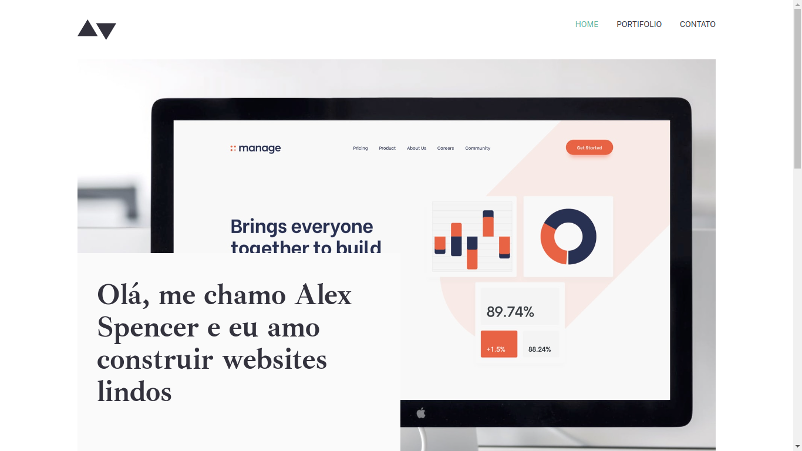
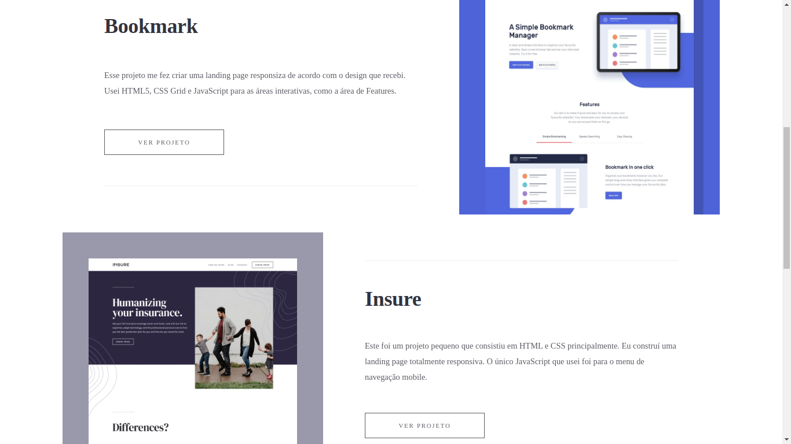
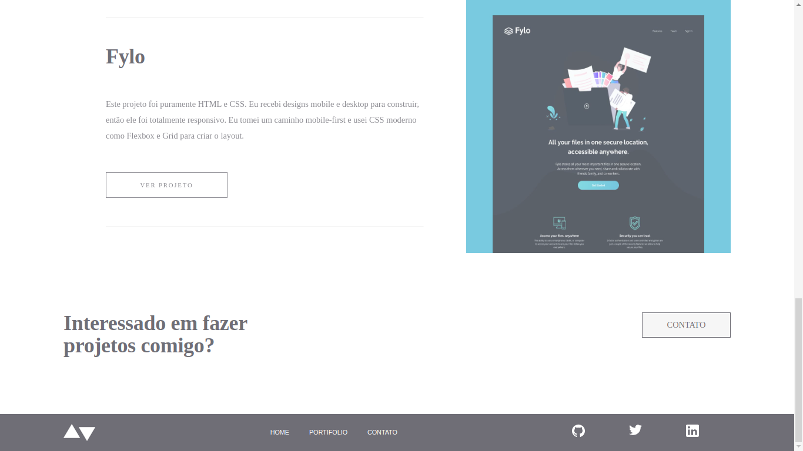
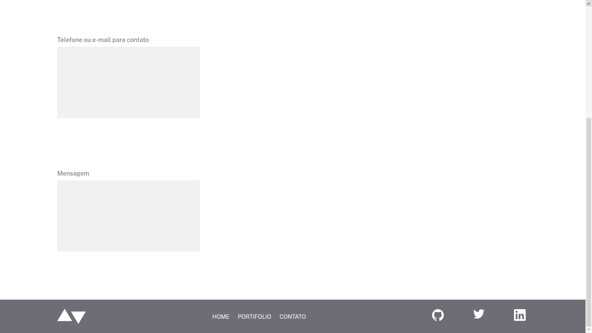

<h1>Meu primeiro projeto :woman_dancing:</h1>

  Esse foi o primeiro projeto que realizei. Onde a proposta era criar um portfólio fictício seguindo um modelo prévio no figma. Esse projeto foi desenvolvido para formalizar a finalização do módulo de Front End no curso de Desenvolvimento Web. Foi um projeto realizado de modo autônomo com prazo estipulado.

 
  <h3>:round_pushpin: Para a criação desse projeto foi usado as seguintes tecnologias:</h3>
  
 
  

  <h3>Neste projeto:</h3>
  
Nesse projeto foram utilizadas diversas tags, estilizações, recursos, entre outros. Para exemplificar o resultado, aqui tem algumas imagens que mostram o resultado obtido: 

  <h5>	:yellow_circle: Nessa imagem é possível ver o uso de alguns recursos como Flexbox, criação de cabeçalho e menu superior</h5>
  

  <h5>	:yellow_circle: Aqui dá para visualizar o uso de Flexbox e o uso da tag href para interação entre páginas</h5>

    
  <h5>	:yellow_circle: Nesta imagem é possível ver o uso de estilos de fontes diferentes, assim como interação entre páginas e criação de rodapé com menu</h5>

  <h5>	:yellow_circle: Nesse último exemplo, é possível ver o uso de formulários e a criação de rodapé com menu</h5>

<h3>Fique à vontade para acessar o projeto e ver todas suas funcionalidades. Para executar esse projeto: </h3>
  
 <h5>:heavy_check_mark: Utilize o comando: <i>git clone</i> no terminal para clonar o repositório</h5>
 <h5>:heavy_check_mark: Vá até a pasta, caso a pasta esteja zipada, não se esqueça de extrair-lo</h5>
 <h5>:heavy_check_mark: Em seguida procure o arquivo principal e o abra</h5>
  

  <h2>Obrigada pela visita, estou à disposição para receber sugestões de melhorias, ou para nos conectarmos. </h2>

   
  
 

 

   <h2>Autora</h2>
   
   
<i>Jamile Moreira</i> - Dev em formação

 

